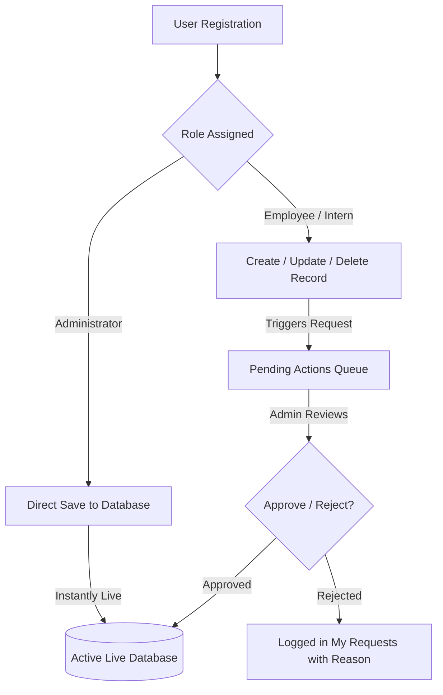

# 🎓 Dayananda Sagar University - International Affairs ERP User Manual

Welcome to the comprehensive user manual for the **Dayananda Sagar University (DSU) International Affairs ERP System**. This Enterprise Resource Planning (ERP) platform is custom-built to streamline, manage, and audit all international affairs, academic partnerships, and global outreach activities at Dayananda Sagar University.

## 🏛️ System Overview

The DSU International Affairs ERP serves as a central repository for **12 core data modules** spanning global collaborations:

| Category | Module | Description |
|---|---|---|
| **Partnerships** | 🤝 **Partners** | Active university and industrial partners worldwide. |
| | ✍️ **MoU Signing** | Ceremonies and execution of Memorandums of Understanding. |
| | 🔄 **MoU Updates** | Revisions, renewals, and current status of active MoUs. |
| **Mobility** | ✈️ **Student Exchange** | Incoming and outgoing exchange student profiles. |
| | 🌍 **Immersion Programs** | Short-term study tours and immersion activities. |
| | 🎓 **Masters Abroad** | DSU students pursuing higher education abroad. |
| **Academic** | 🏫 **Campus Visits** | International delegations and visiting VIPs. |
| | 🧑‍🏫 **Scholars in Residence** | International faculty and scholars teaching/researching at DSU. |
| | 💬 **Conferences** | Co-hosted international symposia and academic events. |
| **Engagement** | 🎉 **Events** | Workshops, guest lectures, and cultural events. |
| | 🏆 **Memberships** | Institutional affiliations with international bodies. |
| | 📱 **Digital Media** | Press releases, news coverage, and outreach campaigns. |

---

## 🔐 The Role-Based Workflow System

To maintain high data integrity and security, the ERP utilizes a **Role-Based Access Control (RBAC)** model coupled with an **Admin Approval Workflow**. There are two primary roles:

### 1. 🛡️ The Administrator (Admin)
The Admin has unrestricted management capabilities:
- **Direct Database Manipulation:** Any new additions, edits, or deletions bypass the queue and are published instantly.
- **Workflow Control:** Access to review, approve, or reject modifications submitted by Employees.
- **User Governance:** Absolute authority to approve pending user registrations, change roles, or deactivate accounts.
- **Auditing:** Unrestricted view of global system activity logs.

👉 **[Access the Admin User Manual](./manuals/ADMIN_MANUAL.md)**

---

### 💼 2. The Employee / Intern
Employees are key data contributors responsible for keeping the system up to date:
- **Data Submission:** Can submit entries, edits, and deletions across all 12 modules.
- **Approval Queue:** All modifications go into a "Pending" state and require Admin review before going live.
- **Request Tracking:** Access to a personalized dashboard ("My Requests") to track request statuses, read approval feedback, or view Admin rejection reasons.

👉 **[Access the Employee User Manual](./manuals/EMPLOYEE_MANUAL.md)**

---

## 🎨 Workspace Customization

The ERP features **32 beautiful built-in UI themes** powered by TailwindCSS and DaisyUI. Whether you prefer a clean professional look (`light`, `corporate`), a battery-saving dark environment (`dark`, `night`, `dim`), or vibrant colorful palettes (`cyberpunk`, `retro`, `synthwave`), you can customize the theme on the **Settings** page.

*Your theme preference is saved to your user profile and persists across logins.*

---

> [!TIP]
> **Need Deployment Help?**
> If you are setting up the ERP on a VPS or cloud server, refer to the [Vite & Node.js VPS Deployment Guide](./.agent/workflows/deploy_to_ubuntu.md) in the project root.
