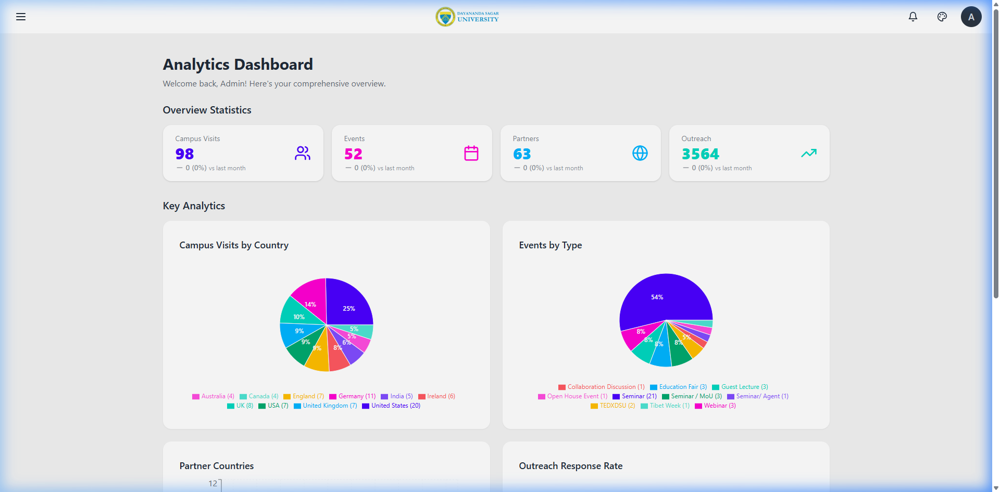

# 🛡️ Dayananda Sagar University - International Affairs ERP Administrator Manual

Welcome to the **Administrator Manual** for the DSU International Affairs ERP. This guide is tailored to help you perform advanced administrative duties, manage users, audit system actions, and oversee the data approval workflow.

---

## 🔑 Getting Started & Login

To log into the administrator portal:
1. Open your browser and navigate to the application URL: https://int-erp.onrender.com/ (or locally: `http://localhost:5173/`).
2. You will be greeted by the secure login screen.
3. Enter your administrator email and password (default: `admin@dsu.edu` / `admin123`).
4. Click **Sign In**.

### The Login Interface

---

## 📊 The Administrator Dashboard

Upon successful login, you will land on the **Analytics Dashboard**. As an administrator, this screen gives you a real-time birds-eye view of all international collaborations at Dayananda Sagar University.

### Key Features of the Dashboard:
- **Core Statistics:** Quick counters showing the total number of Active Partners, MoU Signings, Events, and Scholars in Residence.
- **Visual Analytics:** Interactive, dynamic charts representing partner distribution across different countries, active MoU statuses, and timeline-based event distributions.
- **Quick Links:** Sidebar navigation to quickly access all 12 modules and admin utilities.

---

## 👥 User Management & Registration Approval

To maintain a secure repository, the ERP prevents anonymous or unapproved data access.

### User Registration Workflow:
1. **Registration:** A new employee or intern registers via the registration page.
2. **Pending State:** Their account is automatically set to `Pending` and they cannot log in.
3. **Admin Review:** Go to **User Management** in the sidebar. You will see a list of users requesting access.
4. **Action:**
   - **Approve:** Activates their account, assigns their role (`Employee` or `Intern`), and grants them access.
   - **Reject / Deactivate:** Prevents access and keeps their account blocked.

---

## 🔄 The Data Approval Workflow (Pending Actions)

One of the most important administrative tasks is managing the **Data Approval Workflow**. When an Employee or Intern creates, updates, or deletes any record, their changes do not immediately update the live database. Instead, they trigger an approval request.

### Steps to Approve / Reject Changes:
1. Click **Pending Actions** in the sidebar.
2. You will see a grid of all pending modifications categorized by module.
3. Each item displays:
   - The user who requested the change.
   - The type of change (Create, Edit, or Delete).
   - A detailed visual comparison of the "Original Value" versus the "Proposed Value" (highlighting changes).
4. **To Approve:** Click **Approve**. The changes are immediately committed to the live database and the requesting user is notified.
5. **To Reject:** Click **Reject**. A popup will ask you to enter a **Rejection Reason**. This reason will be displayed to the employee in their dashboard so they can make corrections.

> [!WARNING]
> **Admin Direct Mode:**
> When you (as an Admin) perform any Create, Edit, or Delete operations on the data modules, the changes are **instantly live** and do not require approval. Be careful when updating records!

---

## 🤝 Core Data Modules Management

You can access and directly manage the 12 international affairs data modules from the sidebar.

### Example: Partners Directory
The **Partners** page displays a list of all global institutional alliances.
- **Search & Filter:** Instantly filter by Country, Partnership Type, or active status.
- **Excel Import:** Import bulk records instantly from standard spreadsheets.
- **Export:** Download the currently filtered list in a CSV format.

---

## 📈 Generating Custom Reports

The **Reports** page allows you to generate highly polished documents for presentation or physical record-keeping.

### Step-by-Step Report Generation:
1. Select the specific data module (e.g. MoU Signing, Scholars, Immersion Programs) or generate a "Comprehensive Report".
2. Apply precise filters like date ranges, partner countries, or active status.
3. Choose your format:
   - **📄 Generate PDF Report:** Produces a high-quality PDF containing clean tables, metrics, and DSU branding.
   - **📝 Generate Word (DOCX) Document:** Creates an editable text report.
4. Click **Download** to save the file locally.

---

## 🛡️ Auditing & System Settings

### 🕒 Activity Logs
To audit and track actions for data safety:
- Navigate to **Activity Logs** from the sidebar.
- Review a chronological list of actions taken across the platform: logins, role changes, data modifications, and approvals.
- Each entry displays the user, timestamps, exact module, and the action performed.

### 🎨 Theme Customization
You can customize the workspace aesthetic using the theme selector on the **Settings** page:
- Choose from 32 distinct light, dark, and high-contrast themes.
- Toggle sidebar expansion options to maximize screen real estate on smaller devices.

---

> [!TIP]
> Always log out of your administrator account when using public or shared computers. Click your user profile image in the top-right corner and select **Logout**.
