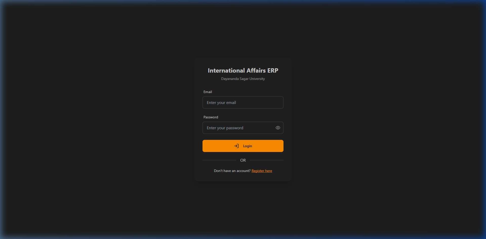
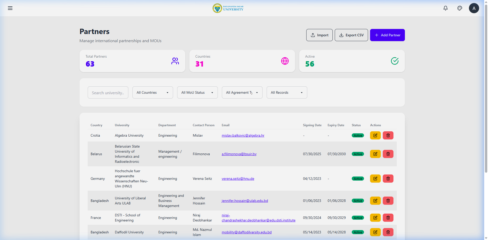
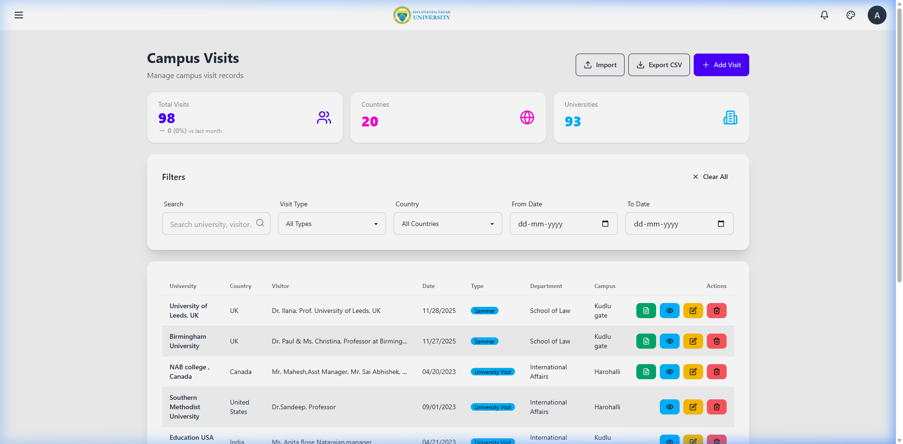
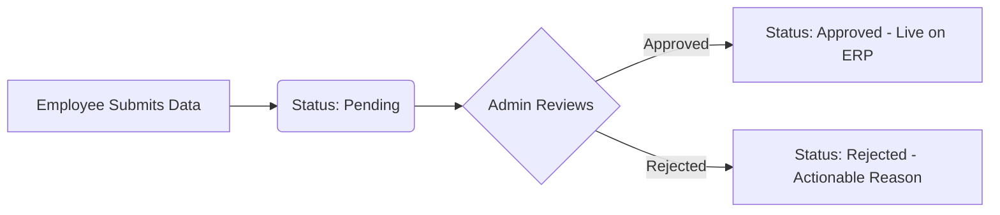
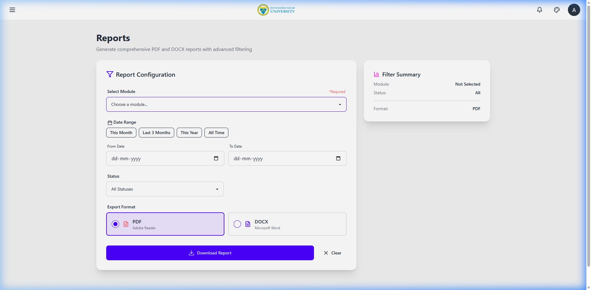
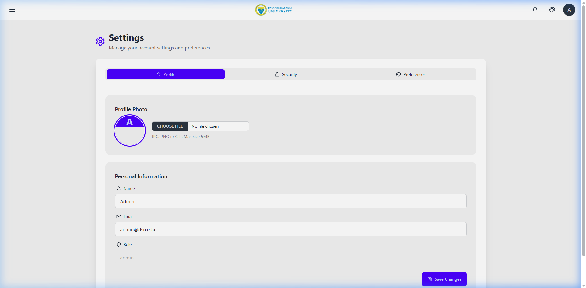

# 💼 Dayananda Sagar University - International Affairs ERP Employee Guide

Welcome to the **Employee and Intern Guide** for the DSU International Affairs ERP. This guide will walk you through registering your account, navigating the 12+ international affairs data modules, contributing data, and tracking the approval of your submissions.

---

## 🔑 Account Registration & Login

To start using the ERP:
1. Open your browser and navigate to the application URL: https://int-erp.onrender.com/.
2. If you do not have an account, click the **Register** link.
3. Fill in your Name, DSU Email Address, password, and select your role (`Employee` or `Intern`).
4. Click **Create Account**.

> [!IMPORTANT]
> **Admin Approval Required:**
> Once you submit your registration, your account is put in a `Pending` state. You must contact a system Administrator to approve your registration before you can log in.

Once approved:
1. Go to the login page.
2. Enter your credentials.
3. Click **Sign In**.

---

## 📋 The Collaborative Data Entry Workflow

As an Employee or Intern, your primary responsibility is to contribute accurate data to DSU's international database. The platform organizes this data into **12 dedicated modules** (e.g. Partners, MoU Signings, Student Exchanges, Campus Visits, Outreach, etc.).

### 1. Viewing & Searching Data
You can browse records in any module by clicking its link in the sidebar.
- **Search:** Use the search bar in the top corner of the grid to filter records instantly by key text.
- **Filters:** Narrow down the list by Country, Status, Date Ranges, or other specialized attributes.
- **Export:** Export the active, filtered list as a CSV file for local spreadsheet analysis.

---

### 2. Submitting New Records
To add a new record to any module:
1. Navigate to the desired module from the sidebar (e.g., **Campus Visits**).
2. Click the **+ Add New** button at the top-right of the table.
3. Fill out the comprehensive form. All fields marked with an asterisk `*` are mandatory.
4. Click **Submit**.

---

### 3. Editing and Deleting Records
- **Editing:** To update information, locate the record in the grid, click the edit icon (pencil), make your modifications in the form, and click **Save Changes**.
- **Deleting:** To remove a record, click the delete icon (trash can) next to the record and confirm the action.

---

## 🔄 The Approval Workflow & My Requests

To maintain high data standardisation and validation, **all Employee contributions must be reviewed and approved by an Administrator.**

### Tracking Submissions on "My Requests"
After you submit a new record, edit, or deletion request, it is saved in a temporary staging state.
1. Click **My Requests** in the sidebar.
2. Here, you will see a chronological dashboard of all your submissions.
3. Each request has one of three statuses:
   - **🟡 Pending:** The Admin has not yet reviewed your submission.
   - **🟢 Approved:** The Admin approved your request, and it is now active on the live dashboard.
   - **🔴 Rejected:** The Admin rejected your request.

### Handling Rejections:
If your submission is rejected, do not worry!
1. Locate the rejected item in your **My Requests** dashboard.
2. Review the **Rejection Reason** provided by the Admin (e.g., *"Missing signed MoU copy"* or *"Incorrect delegation date"*).
3. Click the edit button on the request.
4. Modify the incorrect fields according to the feedback.
5. Resubmit the request for Admin approval.

---

## 📈 Generating Reports

You can generate modules-specific reports to share with departmental heads or include in newsletters.

1. Navigate to the **Reports** page.
2. Select the module you want to report on.
3. Apply filters (e.g., date ranges or countries).
4. Click **Generate PDF** for an instantly styled, printable report, or **Generate DOCX** to download an editable Word file.

---

## 🎨 Theme Customization

You can personalize the visual style of your workspace on the **Settings** page. DSU ERP includes **32 DaisyUI themes**. Select your favorite, and it will remain active whenever you log in!

---

> [!TIP]
> Keep your password secure and never share your login credentials. If you experience any system issues, please reach out to the Admin team.
